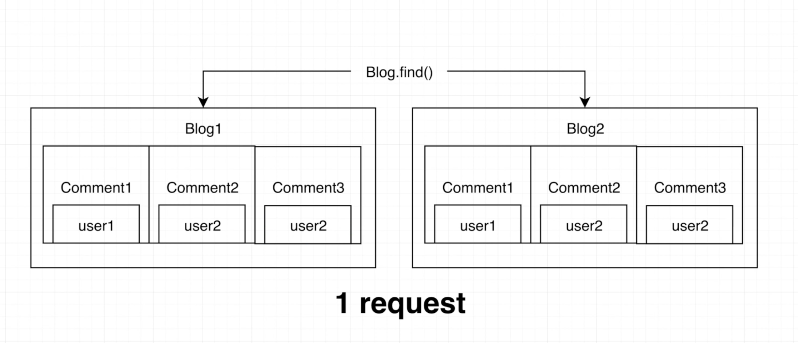

<br>

# 📌 &nbsp; nesting을 이용하여 퍼포먼스 올리기

<br>

👉 &nbsp; 이번 섹션에서는 populate가 아닌 Schema 자체를 다음의 그림과 같이 바꿔서 성능을 올리려고 한다.

<br>



<br>

&nbsp; 이를 객체 형태로 표현하면 다음과 같다.

```js
{
    _id: "blodg의 id값",
    title: "blog의 제목",
    content: "blog의 내용",
    user:{
        _id:"user의 id값",
        username: "user의 이름"
    },
    comments:[
        {
            content: "댓글의 내용",
            user:{
                _id: "user의 id값",
                username: "user의 이름"
            },

        }
         {
            content: "댓글의 내용",
            user:{
                _id: "user의 id값",
                username: "user의 이름"
            },

        }
    ]
}

```

&nbsp; Read의 성능을 올리기 위해 Create, Update, Delete에서 추가적인 작업을 더 해주는게 nesting이라고 생각하면 된다.

&nbsp; 자 그럼 바뀐 스키마에 맞게 코드를 리팩토링하러 가보자!

<br>

## 🔎 &nbsp; Comment Post API 수정하기

<br>

👉 &nbsp; 바뀐 스키마에 의해서 comment는 Blog의 comments에 들어가야 한다.

```js
const [blog, user] = Promise.all([
  Blog.findById(blogId),
  User.findById(userId),
]);

// blog와 user는 무조건 존재한다고 가정하겠다.

const comment = new Comment({ content, user, blog });

await Promise.all([
  comment.save(),
  Blog.updateOne({ _id: blogId }, { $push: { comments: comment } }),
]);
```

&nbsp; 이전과 달리 populate를 사용하지 않기 때문에 $push 메서드를 이용하여 직접 Blog의 comments에 comment를 push해주는 모습을 확인할 수 있다.

<br>

## 🔎 &nbsp; Comment Schema 수정하기

<br>

👉 &nbsp; comment 스키마를 바뀐 설계에 따라 변경하려고 한다.

```js
// CommentSchema.js

// 기존 스키마

const CommentSchema = new Schema({
  content: { type: String, required: true },
  user: {
    _id: { type: ObjectId, required: true, ref: 'user' },
    username: { type: String, required: true },
    name: {
      first: { type: String, required: true },
      last: { type: String, required: true },
    },
  },
  blog: { type: ObjectId, required: true, ref: 'Blog' },
});

// 변경 후 스키마

const CommentSchema = new Schema({
  content: { type: String, required: true },
  user: { type: ObjectId, required: true, ref: 'user' },
  userFullname: { type: String, required: true },
  blog: { type: ObjectId, required: true, ref: 'Blog' },
});
```

&nbsp; 스키마가 바뀌었으니 API 부분도 바꿔주자

```js
const [blog, user] = Promise.all([
  Blog.findById(blogId),
  User.findById(userId),
]);

// blog와 user는 무조건 존재한다고 가정하겠다.

const comment = new Comment({ content, user, userFullName: `${user.name.first} ${user.name.last}` blog });
// user 객체를 넣으면 mongoDB에서 알아서 _id 값만 넣어준다.

```

<br>

## 🔎 &nbsp; nesting의 성능 확인

<br>

👉 &nbsp; 추후에 내가 직접 구현해볼 때 하도록 하겠다!

<br>

## 🔎 &nbsp; '$' 문법을 이용하여 내장된 특정 문서 수정하기

<br>

👉 &nbsp; '$'는 mongoDB에서 데이터를 쉽게 조작할 수 있도록 제공해주는 문법이다. 이를 이용하여 코드를 조작해보자.

```js
commentRouter.patch('/:commentId', async (req, res) => {
  const {commentId} = req.params;
  const {content} = req.body;

  // 에러처리 했다 치고

    const [comment] = await Promise.all([
      Comment.findOneAndUpdate({{_id: commentId},{content}, {new: true}}),
      Blog.updateOne({'comments._id' : commentId},{'comments.$.content': content})
    ]),
    // comments._id도 mongoDB에서 제공해주는 문법이다.
});

```

&nbsp; mongoDB에서 제공해주는 메서드 덕분에 보다 쉽게 데이터를 조작할 수 있다.

<br>

## 🔎 &nbsp; user 정보 수정시, Blog에 적용되게!!

<br>

<br>

# 📌 &nbsp;

<br>

👉 &nbsp;

<br>

# 📌 &nbsp;

👉 &nbsp;

<br>

## 🔎 &nbsp;

<br>

👉 &nbsp;
