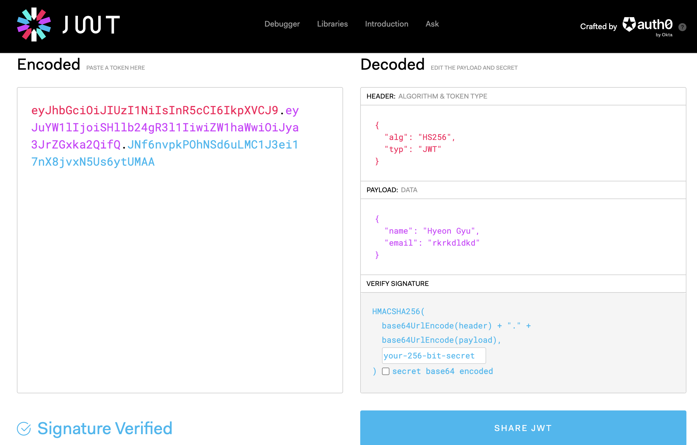
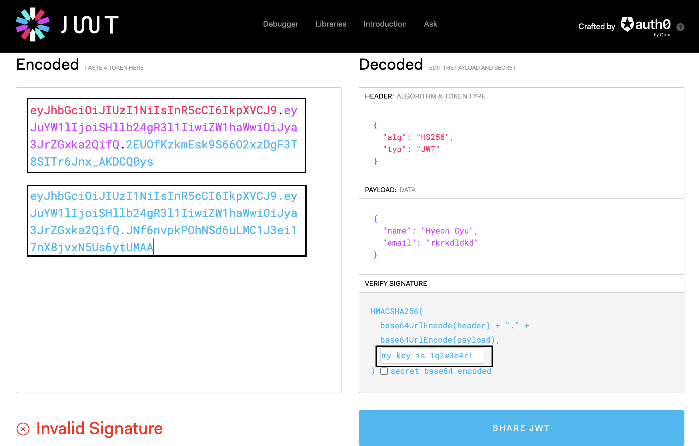

 

# JWT에 대해 배워보자!

 

 

## JWT란?

 

👉 &nbsp; JWT(Json Web Token)은 인증을 위한 정보를 특별한 저장소를 이용하지 않고, 전자 서명을 이용하여 확인하는 방법이다.

 

## JWT의 구성

 

&nbsp; JWT의 구성은 다음과 같다.

1. header - 토큰의 타입(jwt), 데이터 서명 방식
2. payload - 전달되는 데이터
3. signature - 헤더와 페이로드의 전자서명

&nbsp; JWT는 Web Token, 데이터를 웹에서 사용하기 위한 스펙이므로 웹에서 문제없이 사용할 수 있는 문자열로만 구성된 base64 인코딩을 사용한다.

 

## JWT와 보안

 

👉 &nbsp; JWT의 payload는 단순히 정보를 base64 encode를 한 것이다. 따라서 deode시 정보가 노출되기 때문에 민감한 정보는 제외하고 토큰을 생성해야 한다.

&nbsp; 서버는 JWT를 생성할 때, 비공개키를 이용하여 서명을 한다.
payload를 조작할 경우 서명이 일치하지 않기 때문에 인증에 실패한다.

 

## JWT의 작동 방식

 

👉 &nbsp; JWT의 작동 방식은 다음과 같다.

1. 사용자 로그인
2. 서버는 로그인된 유저 정보를 JWT로 생성하여 클라이언트에 전달
3. 클라이언트는 전달받은 JWT를 이용하여 인증이 필요한 요청에 사용

 

## JWT를 사용하는 이유

 

👉 &nbsp; session은 기본적으로 웹 브라우저의 통신 스펙이다.
모바일 앱 등 웹 브라우저가 아닌 어플리케이션의 경우 이를 활용하기 부적합하다.

&nbsp; JWT를 사용하면 어느 클라이언트에서나 동일한 방식의 사용자 인증을 구현할 수 있다.

 

## 자! 한 번 살펴보자!

 

 

👉 &nbsp; 위처럼 payload에 내가 원하는 데이터를 넣고 jwt를 생성했다.

 

 

👉 &nbsp; signature 부분에 key 값을 변경해주자 토큰의 값이 바뀌게 되었다.

&nbsp;맨 위의 jwt 값이 현재의 jwt 값이고, 아래의 jwt 값이 signature 부분을 변경하기 전의 jwt 값이다.

&nbsp; 값이 변경이 되었고, 아래에 invalid signature라는 결과값을 받게 되었다.

&nbsp; 이렇듯 signature를 검증하여 사용자를 인증할 수 있다는 걸 알게되었다.

 

# 정리

 

👉 &nbsp; JWT에 대해 간단하게 배워봤다. 나중에 더 자세하게 알아보면 좋을 것 같다는 생각이 들었다. 또한 편리하게 인증을 할 수 있다는 점에서 나중에 프로젝트를 할 때 사용하면 좋겠다는 생각이 들었다!
