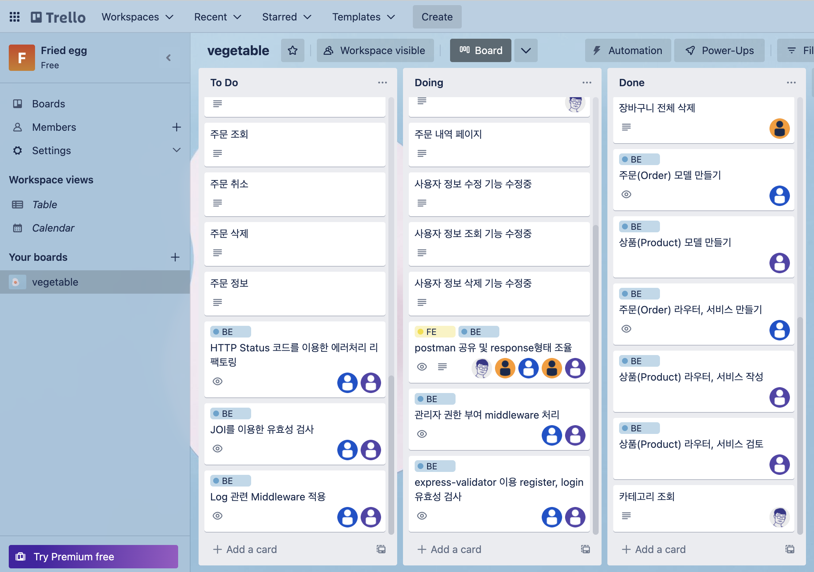

 

# Elice - 1차 프로젝트

 

 

## 팀 링크

 

👉 &nbsp; [트렐로](https://trello.com/b/PP5QltJu/vegetable)

👉 &nbsp; [팀 노션페이지](https://www.notion.so/elice/14-d1b9e98c47b449abaf4d12510fa2763d)

 

## 만든 것...?

 

👉 &nbsp;백엔드 API 문서 작성 - [계란 후라이 API 문서](https://documenter.getpostman.com/view/23999077/2s8YRmJXwV) - 2022. 11. 02

👉 &nbsp;백엔드 API 문서 업데이트 - [계란 후라이 API 문서](https://documenter.getpostman.com/view/23999077/2s8YRmJXwV) - 2022. 11. 03

👉 &nbsp; 트렐로 이용중!! - 2022. 11. 02

 

 

👉 &nbsp; express 생성시 DB 데이터 생성 & 서버 종료시 DB 데이터 삭제 - - 2022. 11. 03

👉 &nbsp; order service, router, model 관련 리팩토링 - 2022. 11. 03

👉 &nbsp; DB에 테스트 데이터 추가 - 2022. 11. 03

👉 &nbsp; populate 적용하여 데이터 가공 - 2022. 11. 04
(id값 잘못 적어서 개고생....또륵)

👉 &nbsp; 스키마, 라우터, 서비스, 모델 변경 - 2022. 11. 04

👉 &nbsp; 에러 처리 리팩토링 - 2022. 11. 05

👉 &nbsp; 스크럼 회의록 작성 - 2022. 11. 07

👉 &nbsp; Jest를 이용한 테스트 코드 추가 - 2022. 11. 08

👉 &nbsp; 스크럼 회의록 작성 - 2022. 11. 09

👉 &nbsp; Front와 API 연동 작업 - 2022. 11. 09

https://engineering.linecorp.com/ko/blog/pm2-nodejs/#PM2%EB%A5%BC%ED%99%9C%EC%9A%A9%ED%95%9CNode.js%EB%AC%B4%EC%A4%91%EB%8B%A8%EC%84%9C%EB%B9%84%EC%8A%A4%ED%95%98%EA%B8%B0-%EC%84%9C%EB%B9%84%EC%8A%A4%EC%9A%B4%EC%98%81%ED%95%98%EA%B8%B0

 

 

👉 &nbsp; 주문(Order) 부분 담당.

1. totalPrice 계산 로직

## 해야할 것

 

👉 &nbsp; 해야할 것은 다음과 같다.

~~1. 에러 헨들링 - HTTP Status Code를 사용하자!~~

~~2. JOI를 이용하여 유효성 검사를 하자!~~

3. DB 설계를 더 공부하자!

4. cs 지식을 더 공부하자! - 2022. 11. 03
   - Rest API
   - var, const, let의 차이
   - scope chaning
   - jwt
   - cors
   - 콜백지옥
