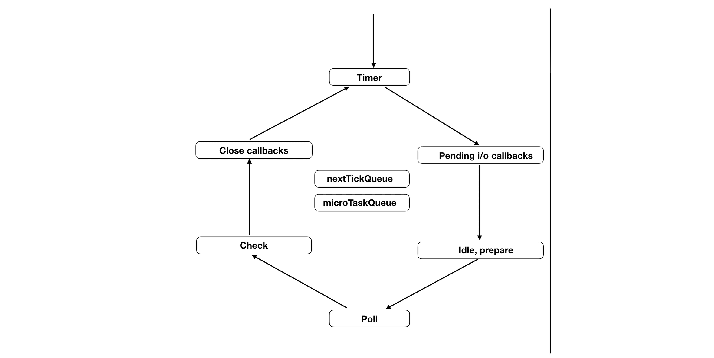
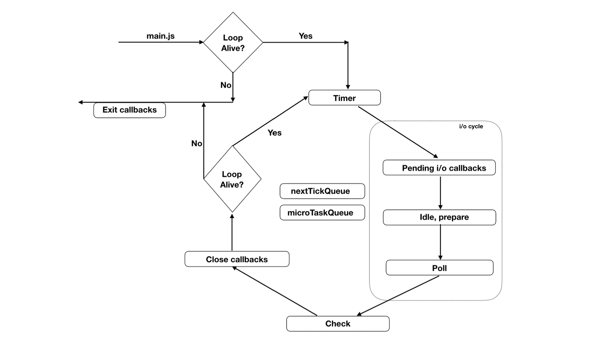

 

# 📌 &nbsp; Event Loop에 대해 알아보자!

 

👉 &nbsp; Event Loop를 이용하여

 

## 🔎 &nbsp; Event Loop의 구조

 

 

 

👉 &nbsp; 위의 그림에 표기된 박스들은 특정 작업을 수행하기 위한 페이즈를 의미한다.

&nbsp; 각 페이즈는 각자 하나의 큐를 가지고 있으며, 자바스크립트의 실행은 이 페이즈들 중 Idle, prepare 페이즈를 제외한 어느 단계에서나 할 수 있다.
(실제론 큐가 아닐 수도 있다고 한다...)

&nbsp; 정리하면 페이즈마다 조건을 검증하고 이를 만족하면 페이즈에 해당하는 큐에 있는 js코드를 실행한다는 말이다.

&nbsp; 또한 nextTickQueue와 microTaskQueue는 Event Loof의 일부가 아니다. 따라서 이 큐에 들어있는 작업들은 가장 높은 실행 우선 순위를 가지고 있고 어떤 페이즈에서든 실행될 수 있다.

&nbsp; 밑에서 Event Loop의 작동에 대해 더 자세히 알아보기로 하고 일단 각 페이즈가 어떤 작업을 수행하는지에 대해 알아보도록 하자!

 

### ✏️ &nbsp; Timer phase

 

👉 &nbsp; 이벤트 루프의 시작을 알리는 페이즈이다. Timer phase가 가지고 있는 큐는 setTimeout이나 setInterval 같은 타이머 들의 콜백을 저장하게 된다.

&nbsp; 이 페이즈에서 바로 타이머들의 콜백이 큐에 들어가는 것은 아니지만 타이머들은 min-heap으로 유지하고 있다가 실행할 때가 된 타이머들의 콜백을 큐에 넣고 실행하는 것이다.

&nbsp; 조금 더 자세히 알아보자면 힙에 타이머를 저장한다. 이때 타이머가 저장될 때마다 min-heap 알고리즘?을 통해 가장 빠른 타이머 순으로 정렬을 하게 된다. 그러고 나서 Event Loof가 돌면서 timer phase가 될 때 어떤 타이머가 실행할 때가 되었는지를 검사한 후, 실행되어야 하는 콜백만 큐에 넣는다. 그리고 큐에 담긴 콜백을 실행한다.

 

### ✏️ &nbsp; Pending i/o callback phase

 

👉 &nbsp; 이 페이즈의 큐에 들어가는 것들은 현재 돌고 있는 루프 이전에 한 작업에서 이미 큐에 들어와있던 콜백들이다. (이 부분은 아직 이해가 안간다.)

&nbsp; 예를 들어 TCP 핸들러 콜백 함수에서 파일에 뭔가를 썼다면 TCP 통신이 끝나고 파일 쓰기도 끝나고 나서 파일 쓰기의 콜백이 이 큐에 들어오는 것이다. 왜냐? 파일쓰기는 보통 비동기로 이루어지기 때문이다. 또한 에러 핸들러 콜백도 이 큐에 들어오게 된다.

 

### ✏️ &nbsp; Idle, Prepare phase

 

👉 &nbsp; Idel phase지만 이 페이즈는 매 Tick마다 실행된다. Prepare phase 또한 매 폴링때마다 실행된다. 이 두 개의 페이즈는 Event Loof와 직접적인 관계가 있다기 보다는 Node.js의 내부적인 관리를 위한 것이기 때문이라고 해서 추후에 더 알아보도록 하겠다.

 

### ✏️ &nbsp; Poll phase

 

👉 &nbsp; 이 페이즈에서는 새로운 수신 커넥션(새로운 소켓 설정 등)과 데이터(파일 읽기 등)를 허용한다.

&nbsp; 여기서 일어나는 일을 크게 두 가지로 나눠볼 수 있다.

1. 만약 watch_queue가 비어있지 않다면, 큐가 비거나 시스템 최대 실행 한도에 다다를 때까지 동기적으로 모든 콜백을 실행한다.

2. 만약 watch_queue가 비어있다면, Node.js는 곧바로 다음 페이즈로 넘어가는 것이 아니라 약간 대기시간을 가지게 된다. 여기서 기다리는 시간은 여러 요인에 따라 계산되는데, 밑에서 자세히 알아보도록 하자.

 

### ✏️ &nbsp; Check phase

 

👉 &nbsp; Check phase는 setImmediate의 콜백만을 위한 페이즈이다. 왜 setImmediate의 콜백만을 위한 큐인지는 밑에서 더 자세히 알아보도록 하고 일단 넘어가자.

 

### ✏️ &nbsp; close callbacks

 

👉 &nbsp; socket.on('close', () => {})과 같은 close 이벤트 타입의 핸들러들은 여기서 처리된다.

 

### ✏️ &nbsp; nextTickQueue와 microTaskQueue

 

👉 &nbsp; nextTickQueue는 process.nextTick() API의 콜백들을 가지고 있으며, microTaskQueue는 Resolve된 프로미스의 콜백을 가지고 있다.

 

## 🔎 &nbsp; 이벤트 루프의 작업 흐름

 

👉 &nbsp; 우리가 node my-script.js를 콘솔에서 실행시켰을 때, Node.js는 이벤트 루프를 생성한 다음 이벤트 루프 바깥에서 메인 모듈인 my-script.js를 실행한다.

&nbsp; 한 번 메인 모듈이 실행되고 나면 Node.js는 이벤트 루프가 활성 상태인지, 즉 이벤트 루프 안에서 해야할 작업이 있는지를 확인한다. 만약 이벤트 루프를 돌릴 필요가 없다면 Node.jssms process.on('exit', () => {})를 실행하고 이벤트 루프를 종료하려고 할 것이다.

&nbsp; 그러나 만약 이벤트 루프를 돌려야할 상황이라면 Node.js는 이벤트 루프의 첫 번째 페이즈인 Timer phase를 실행한다.

 

 

 

### ✏️ &nbsp; Timer phase

 

👉 &nbsp; 이벤트 루프가 Timer phase에 들어가게 되면 큐에 실행할 타이머 콜백이 있는지 확인한다.

&nbsp; 이때 타이머를 확인하는 단계는 다음과 같다.

1. 타이머 스크립트는 오름차순으로 힙에 저장된다.

2. 제일 먼저 저장된, 즉 min-heap의 최상단에 저장된 타이머를 하나 뺀다.

3. now - registerdTime === delta 같은 조건을 통해서 타이머의 콜백이 실행할 때가 되었는지를 검사한다.

4. 만약 조건에 해당한다면 콜백을 실행하고 다음 타이머를 확인한다. 만약 조건에 해당하지 않는 타이머를 만난다면, 탐색을 종료하고 다음 페이즈로 이동한다.

&nbsp; 추가로 현재 체크하는 타이머가 실행할 시간이 아니라면 바로 다음 페이즈로 이동한다. 왜냐하면 정렬이 되어있기 때문에 더 알아보는 건 낭비이기 때문이다.

&nbsp; 또한 페이즈는 시스템의 실행 한도에도 영향을 받고 있으므로, 실행되어야 하는 타이머가 아직 남아있다고 하더라도 시스템 실행 한도에 도달한다면 바로 다음 페이즈로 넘어가게 된다.

 

### ✏️ &nbsp; Pending i/o phase

 

👉 &nbsp; Time phase가 종료된 후 이벤트 루프는 Pending i/o 페이즈에 진입한다. Event Loof는 pending_queue에 콜백이 있는지 체크한다.

&nbsp; 만약 실행 대기중이라면 pending_queue가 비거나 시스템의 실행 한도 초과에 도달할 때까지 대기하고 있던 콜백들을 실행한다.

&nbsp; 이 과정이 종료되면 이벤트 루프는 Idle Handler phase로 이동하게 된 후 내부 처리를 위한 Prepare phase를 거쳐 최종적으로 가장 중요한 단계인 Poll Phase에 도달하게 된다.

 

### ✏️ &nbsp; Poll phase

 

👉 &nbsp; 이 페이즈는 폴링하는 단계이다. Event Loof는 watcher_queue 내부에 파일 읽기의 응답 콜백, Http 응답 콜백 같이 수행해야 할 작업들이 있다면 이 작업들을 실행하게 된다. 이 과정또한 watcher_queue가 비거나 시스템의 실행 한도 초과에 다다를 때까지 계속 된다.

&nbsp; 만약 더 이상 콜백들을 실행할 수 없는 상태가 된다면 만약 check_queue, pending_queue, closeing_callbacks_queue에 해야할 작업이 있는지를 검사하고, 만약 해야할 작업이 있다면 바로 Poll phase가 종료되고 다음 페이즈로 넘어가게 된다. 하지만 특별히 해야할 작업이 더 이상 없는 경우 Poll phase는 다음 페이즈로 넘어가지 않고 계속 대기하게 된다.

&nbsp; 이때도 마냥 무한 대기를 하는 것은 아니고, 타이머 힙에서 첫 번째 타이머를 꺼내본 다음에 만약 타이머가 실행 가능한 상태라면 그 타이머의 딜레이 시간만큼만 대기 시간을 결정한다.

&nbsp; 바로 타이머로 이동하지 않는 이유는 어차피 대기하지 않고 바로 Timer phase에 넘어갈 경우 어차피 첫 번째 타이머를 실행할 수 있는 시간이 안되었기 때문에 아무 것도 수행하지 않고 Timer phase가 끝나버리기 때문이다. 그렇게 되면 굳이 이벤트 루프를 한 번 더 돌아야하기 때문에 그냥 Poll phase에서 대기하는 게 이득인 것이다.

 

### ✏️ &nbsp; Check phase

 

👉 &nbsp; 다른 페이즈에서와 마찬가지로 큐가 비거나 시스템 실행 한도 초과에 도달할 때까지 계속해서 setImmediate의 콜백들을 실행한다.

 

### ✏️ &nbsp; Close callback

 

👉 &nbsp; close callback은 close나 destroy 콜백 타입들을 관리한다.

&nbsp; Event Loof가 Close callback들과 함께 종료되고 나면 이벤트 루프는 다음에 돌아야할 루프가 있는지 다시 체크하게 된다. 만약 아니라면 이벤트 루프는 종료된다. 하지만 만약 수행할 작업들이 남아있다면 이벤트 루프는 다음 순회를 돌기 시작하고 다시 Timer Phase부터 시작하게 된다.

 

### ✏️ &nbsp; nextTickQueue & microTaskQueue

 

👉 &nbsp; 그렇다면 Event Loof에 속하지 않은 두 큐에 있는 콜백들은 언제 실행되는 걸까?

&nbsp; 이 두 큐의 콜백들은 어떤 페이즈에서 다음 페이즈로 넘어가기 전에 자신이 가지고 있는 콜백들을 최대한 빨리 실행해야하는 역할을 맡고 있다.
이때, 다른 페이즈로 넘어가는 과정을 Tick이라고 부른다.

&nbsp; 다른 페이즈들과 다르게 이 두 큐는 시스템 실행 한도 초과에 영향을 받지 않기 때문에 Node.js는 이 큐가 완전히 비워질 때까지 콜백들을 실행한다.
그리고 nextTickQueue는 microTaskQueue보다는 높은 우선 순위를 가지고 있다.

 

### ✏️ &nbsp; Thread-pool

 

👉 &nbsp; 스레드풀은 Node.js가 가지고 있는게 아니라 libUV에 포함된 기능이다.

&nbsp; livUV는 OS커널의 비동기 API만을 사용하여 이벤트 드리븐을 유도할 수 있을 만큼 훌륭하다. 그러나 파일 읽기, DNS LookUp등 OS 커널이 비동기 API를 지원하지 않는 작업들의 경우에는 별도의 스레드풀을 사용하게 되는데, 이때 기본 값으로 4개의 스레드를 사용하도록 설정되어있다. uv)threadpool 환경 변수를 사용하면 최대 128개까지 스레드 개수를 늘릴 수 있다.

 

# 📌 &nbsp; 정리

 

👉 &nbsp; 이벤트 루프에 대해 막연하게만 알고있었다. 이번에 자세하게 이벤트 루프의 구조와 흐름을 보면서 싱글 스레드의 한계 해결 및 성능을 끌어올리기 위해 이러한 것들을 만들었다는 것이 대단하다고 느꼈다.

&nbsp; 아직 모든 것들을 정확하게 파악할 수는 없을 것 같지만 흐름 정도는 파악했으니 이를 이용하여 프로젝트의 완성도를 더 높이고, 재밌게 코드를 설계 및 작성할 수 있겠다는 생각이 들었다.

&nbsp; 너무너무 재밌는 시간이었다.
