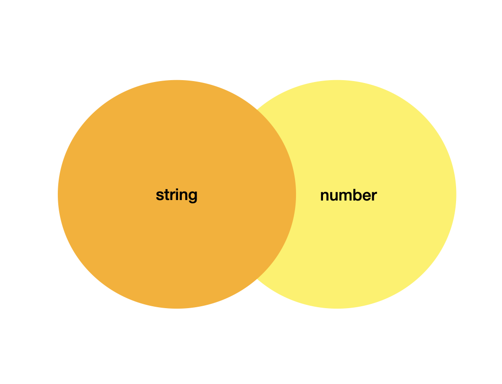
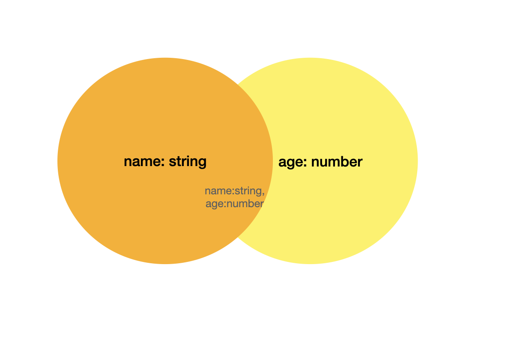

<br>

# 📌 &nbsp; Typescript란?

<br>

👉 &nbsp; Typescript는 tsc(TypeScript Compiler)를 이용하여 Ts를 Js로 변환해준다.

&nbsp; Ts를 사용하면 될 것을 왜 변환을 하는 걸까? 이유는 현재 주류인 런타임(브라우저, 노드)에서 Ts를 실행할 수 없기 때문에 Js로 변환 후 사용하는 방식을 사용한다.

&nbsp; tsc가 하는 역할은 다음의 두 가지이다.

1. TS -> JS로의 변환

2. 타입 검사

&nbsp; 이때 tsc는 tsconfig.json을 참고하여 옵션을 정해서 컴파일을 한다.

<br>

# 📌 &nbsp; Typescript 꿀팁!?

<br>

<br>

## 🔎 &nbsp; type을 집합으로 생각하자!

<br>

👉 &nbsp; 넓은 타입에 좁은 타입을 대입할 수 있다. 이렇게만 말하면 이해하기 어려울 테니 예시를 통해 알아보도록 하자.

- type A = string | number;

- type B = string;

&nbsp; 위의 두 가지 타입이 있을 때, 어떤 타입이 더 넓은 타입일까??

&nbsp; 바로 type A가 더 넓은 타입이다. 이는 수학의 집합을 생각해보면 이해하기 쉽다.

<br>



<br>

&nbsp; type A는 주황색 원 또는 노란색 원이기 때문에 두 원을 포함하는 합집합의 범위를 가진다. 이에 반해 type B는 주황색 원의 범위만 가진다.

&nbsp; 따라서 type B는 type A에 포함될 수 있다.

```js
type A = string | number;
type B = string;

const b: B = 'hello';
const a: A = b;
```

&nbsp; 집합의 개념을 통해 이해한 후 위의 코드가 정상적으로 잘 동작한다는 것을 쉽게 이해할 수 있었다.

&nbsp; 다음은 객체에서의 타입 범위이다.

- type A = {name: string};

- type B = {age: number};

- type C = {name: string, age: number};

&nbsp; 위의 경우에 C가 A보다 더 넓어 보인다. 맞는지 이번에도 집합을 통해 알아보자.

<br>



<br>

&nbsp; 벤다이어그램을 보기 전까진 C가 더 넓은 타입이라 생각했는데, 벤다이어그램을 확인해보니 더 좁은 범위인 것을 확인할 수 있다.

&nbsp; 즉, 객체는 프로퍼티가 더 많을수록 더 좁은 범위이다.

```js
type A = { name: string };
type B = { age: number };
type C = A & B;
type AB = A | B;

const ab: AB = C;
```

&nbsp; 따라서 위의 코드가 유효하다는 것을 쉽게 이해할 수 있게 되었다.
